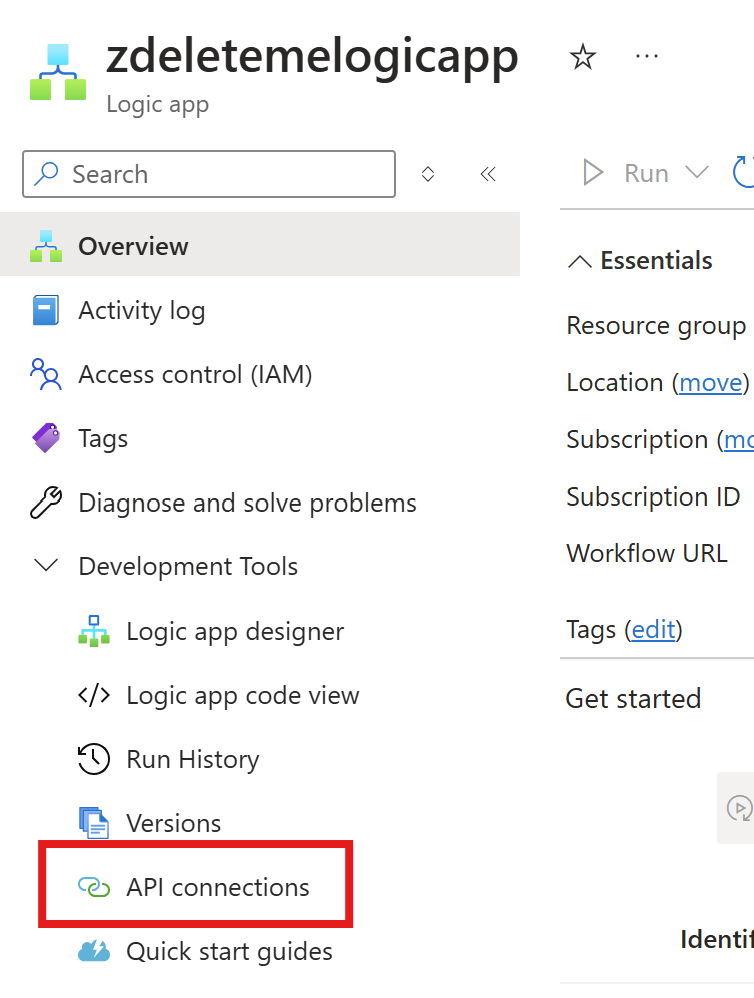

## Notes
If you want to change the function app code you can git clone the repo. Every time you change the FunctionApp code, be sure to repackage the FunctionApp.zip file. The zip file is what is referenced when the solution is deployed. The local .python_packages folder is necessary when deploying in this "push to deploy" manner. 

## Deploy the Solution

### Step 1: Deploy the Function App

Click the button below to deploy the Function App. You will be prompted to select or create a resourceGroup, and provide a unique FunctionAppName. FunctionApp names must be unique to the world. 

### Step 2: Deploy the Logic App

Click the button below to deploy the Logic App. Have your VirusTotal API key ready and your Function App name & resource group. You will enter this information in the deployment screen. 

### Step 3: Initialize O365 and Security Copilot API connections

Open your new Logic App.

Click "API Connections"

Authorize both of the API connections.

